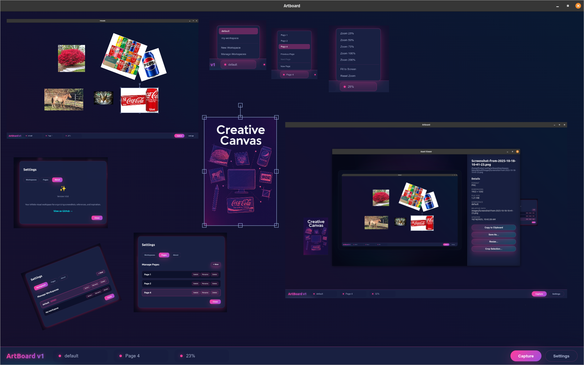

# Artboard

**A free, open-source visual workspace for creative professionals**

Artboard is a powerful desktop application for organizing reference images, screenshots, and web assets into infinite canvases. Built for designers, developers, and creative thinkers who need to capture, arrange, and iterate on visual ideas quickly.



> **Beta Notice:** Artboard is currently in beta. While fully functional, you may encounter bugs or missing features. Please report any issues to help us improve!

---

## ✨ Features

### 🎨 Infinite Canvas
- **Unlimited workspace** – Pan, zoom, and organize assets on an infinite artboard
- **Multi-page support** – Create multiple pages within each workspace for better organization
- **Drag-and-drop** – Add local files, remote URLs, or clipboard images instantly

### 📸 Capture & Ingest
- **Built-in screenshot tool** – Capture screen regions directly to your artboard
- **Multi-display support** – Choose which display to capture from
- **URL fetching** – Paste image URLs to automatically download and add to canvas
- **Format support** – Works with PNG, JPG, GIF, WebP, and more

### 🗂️ Workspace Management
- **Multiple workspaces** – Organize different projects separately
- **Persistent storage** – All assets and layouts saved locally
- **Asset viewer** – Full-screen image inspection with editing tools
- **Custom protocol** – Efficient `artboard://` protocol for asset loading

### 🛠️ Image Tools
- **Copy to clipboard** – Quick copy for sharing
- **Format conversion** – Convert between PNG, JPG, WebP
- **Resize & crop** – Basic image manipulation built-in
- **Save anywhere** – Export individual assets or full workspaces

### 🖥️ Cross-Platform
- **Linux** – AppImage for easy installation
- **Windows** – NSIS installer with x64 support
- **macOS** – ZIP archive for macOS x64

---

## 📥 Download

### Prepackaged Releases

Download the latest version for your platform:

| Platform | Download | Notes |
|----------|----------|-------|
| **Linux** | [Artboard-x86_64.AppImage](../../releases/latest) | Portable AppImage, no installation required |
| **Windows** | [Artboard Setup.exe](../../releases/latest) | x64 NSIS installer |
| **macOS** | [Artboard-mac.zip](../../releases/latest) | x64 ZIP archive, extract and run |

> **Releases:** Check the [Releases](../../releases) page for all available versions and changelogs.

### System Requirements
- **OS:** Windows 10+, macOS 10.13+, or modern Linux distribution
- **Architecture:** x64 (64-bit)
- **RAM:** 4GB minimum, 8GB recommended
- **Storage:** 100MB for app + space for your assets

---

## 🚀 Quick Start (End Users)

1. **Download** the installer for your platform from the [Releases](../../releases) page
2. **Install** (or extract) the application
3. **Launch** Artboard
4. **Create** your first workspace and start adding assets!

### Usage Tips
- **Add images:** Drag files from your file manager or paste image URLs
- **Screenshot:** Click the camera icon to capture screen regions
- **Navigate:** Use mouse wheel to zoom, click-drag to pan
- **Organize:** Create multiple pages within a workspace for better organization
- **Inspect:** Right-click images to open in the asset viewer for editing

---

## 🛠️ Development

Want to build from source or contribute? Here's how to get started.

### Prerequisites

- [Bun](https://bun.sh/) v1.3 or newer
- [Node.js](https://nodejs.org/) (used by Electron)
- [Git](https://git-scm.com/)
- macOS, Windows, or Linux (x64)

### Installation

```bash
# Clone the repository
git clone https://github.com/your-org/artboard.git
cd artboard

# Install dependencies
bun install
```

### Development Workflow

```bash
# Build and launch in development mode
bun run dev

# Or build once and start
bun run build
bun run start

# For faster renderer iteration
bun run browser:watch    # In one terminal
bun run start            # In another terminal
```

### Building Releases

Generate platform-specific installers:

```bash
# Linux AppImage
bun run pack:linux

# Windows NSIS installer
bun run pack:win

# macOS ZIP archive
bun run pack:mac

# All platforms at once
bun run pack:all
```

**Output:** Built packages appear in the `release/` directory.

> **Platform-specific builds:** macOS code signing requires building on macOS. Windows code signing requires Windows-specific tooling.

---

## 🤝 Contributing

Contributions are welcome! Whether it's bug fixes, new features, or documentation improvements, we appreciate your help.

### How to Contribute

1. **Fork** the repository
2. **Create** a feature branch (`git checkout -b feature/amazing-feature`)
3. **Make** your changes
4. **Test** your changes (`bun run build` to verify compilation)
5. **Commit** with clear messages (`git commit -m 'Add amazing feature'`)
6. **Push** to your branch (`git push origin feature/amazing-feature`)
7. **Open** a Pull Request

### Development Guidelines
- Follow existing code style and patterns
- Test on your target platform before submitting
- Update documentation if adding new features
- Run `bun run pack:linux` (or your platform's script) if modifying build tooling

---

## 🐛 Bug Reports & Feature Requests

Found a bug or have an idea? We'd love to hear from you!

**Before submitting:**
- Check if the issue already exists in the [Issues](../../issues) tracker
- For bugs, gather reproduction steps, screenshots, and platform details
- For features, describe the use case and expected behavior

**Submit an issue:** [Create New Issue](../../issues/new)

---

## 📋 Roadmap

Planned features and improvements:

- [ ] Text annotations and sticky notes
- [ ] Collaboration and cloud sync
- [ ] Vector shape tools
- [ ] Plugin system for extensibility
- [ ] Touch and pen input support
- [ ] Dark mode
- [ ] ARM64 builds (Apple Silicon, ARM Linux)

---

## 🏗️ Architecture

Built with modern web technologies:

- **Runtime:** [Bun](https://bun.sh/) v1.3
- **Framework:** [Electron](https://www.electronjs.org/) (ESM mode)
- **Canvas:** [Fabric.js](http://fabricjs.com/)
- **Language:** TypeScript (strict mode)
- **Screenshots:** [electron-screenshots](https://github.com/nashaofu/electron-screenshots)

**Key Design Decisions:**
- Custom `artboard://` protocol for efficient asset loading
- ESM-first module system for modern JavaScript
- Debounced persistence to minimize disk writes
- Multi-process architecture (main, renderer, asset viewer)

For detailed architecture documentation, see [CLAUDE.md](CLAUDE.md).

---

## 📄 License

This project is open source. See the [LICENSE](LICENSE) file for details.

---

## 🙏 Acknowledgments

Built with amazing open-source tools:
- [Electron](https://www.electronjs.org/) - Cross-platform desktop apps
- [Fabric.js](http://fabricjs.com/) - Powerful canvas library
- [Bun](https://bun.sh/) - Fast JavaScript runtime
- [electron-screenshots](https://github.com/nashaofu/electron-screenshots) - Screenshot functionality

---

**Made with ❤️ by the Artboard community**

⭐ Star this repo if you find it useful! | 📢 [Report Issues](../../issues) | 💬 [Discussions](../../discussions)
